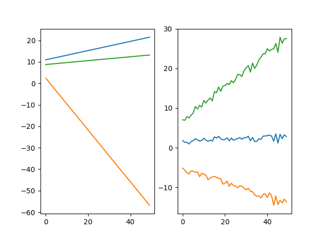
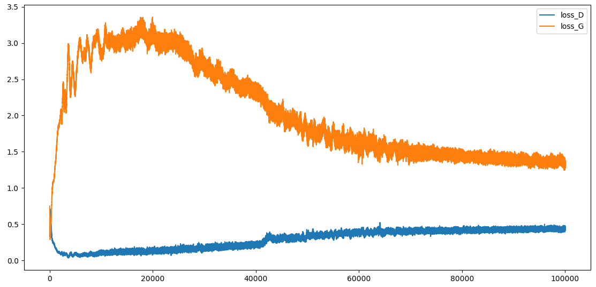

# simple_gan
Simple examples of generative adversarial nets (GAN)

实现了两个GAN的案例：
- **simple_gan**: 任意直线形状的GAN;
- **img_gan.py**：基于MNIST手写数字的GAN.

## 1 Requirment
- python3
- numpy >= 1.14.2
- keras >= 2.1.6
- h5py >= 2.7.0
- pandas >= 0.20.1

## 2 Start training
### 2.1 训练simple_gan.py
```python
python simple_gan.py
```
训练的预期结果：

1) 下图中，左侧为我们预先设定的在任意直线上的线性点集合，右侧为生成模型(Generative Model)经过GAN训练后得到的学习生成的"假"直线：
2) 下图为simple_gan中判别模型(Discriminative Model)和生成模型(Generative Model)在训练过程中损失函数的变化情况 

### 2.2 训练img_gan.py
```python
python img_gan.py
```

## 3 References
[1]. [Goodfellow, Ian, et al. "Generative adversarial nets." Advances in neural information processing systems. 2014.](http://papers.nips.cc/paper/5423-generative-adversarial-nets.pdf)

[2]. [Keras-GAN (a very good GAN project based on keras in github)](https://github.com/eriklindernoren/Keras-GAN)

[3]. http://www.rricard.me/machine/learning/generative/adversarial/networks/keras/tensorflow/2017/04/05/gans-part2.html#Imports
