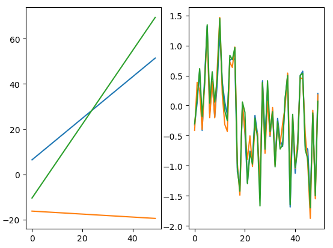
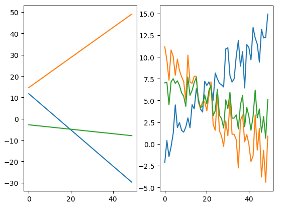
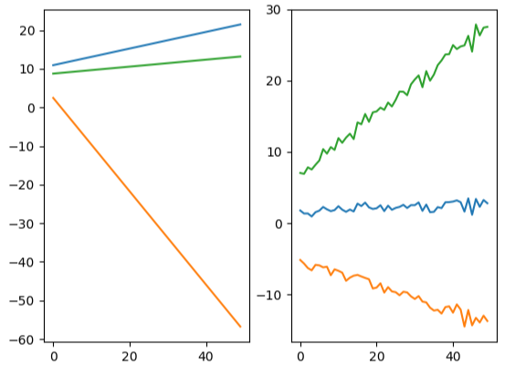

# simple_gan
**Simple examples of generative adversarial nets (GAN)**

**生成对抗网络GAN的简单实现案例，基于keras库.**

实现了两个GAN的案例：
- **simple_gan**: 任意直线形状的GAN;
- **img_gan.py**：基于MNIST手写数字的GAN.

## **1 Requirment**
- python3
- numpy >= 1.14.2
- keras >= 2.1.6
- h5py >= 2.7.0
- pandas >= 0.20.1

## **2 Training algorithm of GAN**
生成对抗网络 GAN 的基本思想框架(以mnist案例为例)：


下图是GAN的训练算法，来源于Goodfellow论文内容，具体可参考[[1]](http://papers.nips.cc/paper/5423-generative-adversarial-nets.pdf)


## **3 Start training**
### **3.1 训练simple_gan.py**
```python
python simple_gan.py
```
训练的预期结果：

下列图中，左侧为我们预先设定的在任意直线上的线性点集合，右侧为生成模型(Generative Model)经过GAN训练后得到的学习生成的"假"直线：

epoch = 100:



epoch = 10000:



epoch = 50000:



下图为simple_gan中判别模型(Discriminative Model)和生成模型(Generative Model)在训练过程中损失函数的变化情况:


可以看出，生成模型的损失函数经过训练逐渐降低，同时判别模型的损失缓慢上升，即判别模型越来越难辨别真实数据和假的生成数据.

### **3.2 训练img_gan.py**
```python
python img_gan.py
```

## **4 References**
[1]. [Goodfellow, Ian, et al. "Generative adversarial nets." Advances in neural information processing systems. 2014.](http://papers.nips.cc/paper/5423-generative-adversarial-nets.pdf)

[2]. [Keras-GAN (a very good GAN project based on keras in github)](https://github.com/eriklindernoren/Keras-GAN)

[3]. http://www.rricard.me/machine/learning/generative/adversarial/networks/keras/tensorflow/2017/04/05/gans-part2.html#Imports
